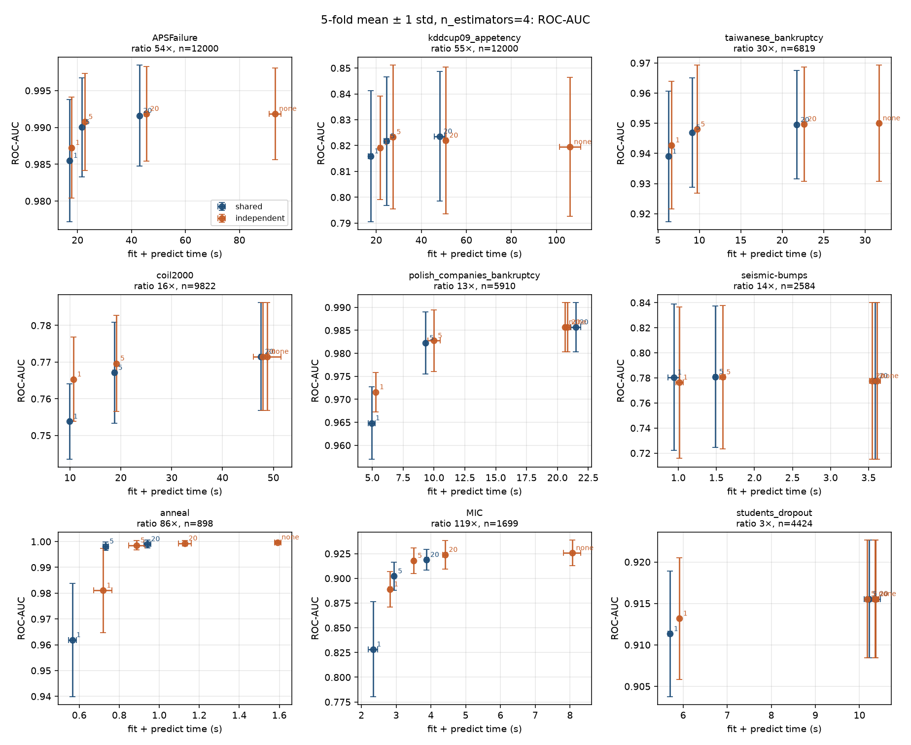
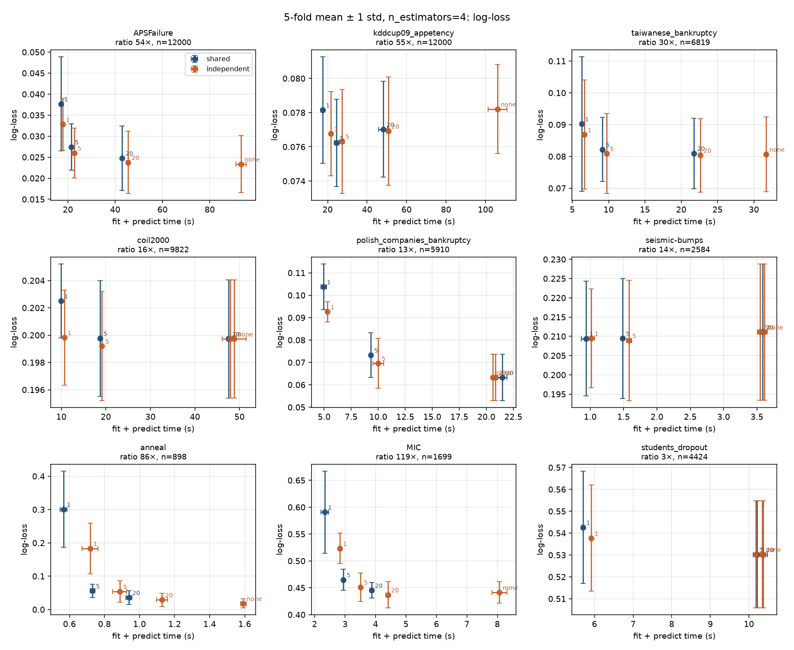

# Shared subsample vs one subsample per ensemble member

5-fold CV, `n_estimators=4`, caps `{1, 5, 20, None}`. Same TabArena tasks as the earlier study. APSFailure and kddcup09_appetency are stratified to 12,000 rows. `None` does not undersample, so it is run once.

**Shared:** one majority subsample, then the usual feature, class, and normalization ensemble on those rows, then one Elkan correction.

**Independent:** each member draws its own majority subsample and is normalized on those rows. Logits are averaged, softmax is applied, and one Elkan correction uses the shared context class counts.

Points below are fold means. Bars are ±1 standard deviation. Blue is shared, orange is independent.

`Δ` is the mean over folds of independent minus shared on the same fold.

| Cap | Where it matters | Δ ROC-AUC | Δ log-loss | Time |
| --- | --- | ---: | ---: | --- |
| 1 | MIC (8 classes) | +0.061 ± 0.036 | −0.067 | 2.3 s → 2.8 s |
| 1 | anneal (5 classes) | +0.019 ± 0.014 | −0.117 | 0.57 s → 0.72 s |
| 1 | mean over 9 tasks | +0.012 | −0.024 | a few percent slower |
| 5 | MIC | +0.016 ± 0.008 | −0.014 | 2.9 s → 3.5 s |
| 5 | mean over 9 tasks | +0.002 | −0.003 | similar |
| 20 | MIC | +0.005 ± 0.009 | −0.008 | 3.9 s → 4.4 s |
| 20 | tasks already within 20× | 0 | 0 | same context |

The gain is concentrated where the cap throws away most of a large majority class, especially with several classes (MIC, anneal, cap 1 or 5). Four different majority draws recover ranking and calibration that one shared draw loses. Once the cap is 20, most binary tasks are unchanged, and MIC's remaining AUC gap is inside the fold noise. Independent members cost a little extra time because each member fits its own normalizer.
