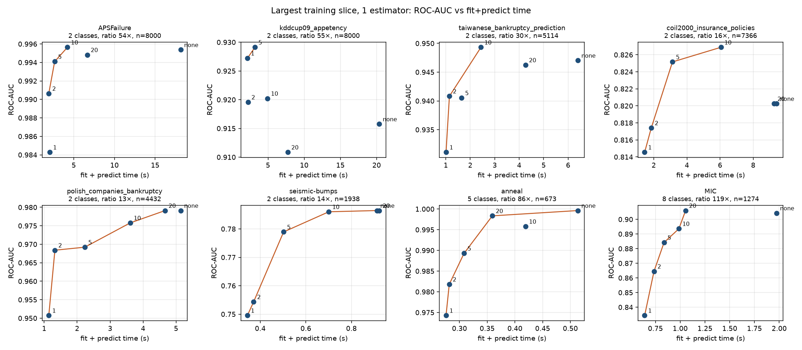
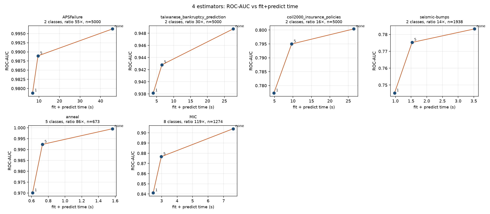
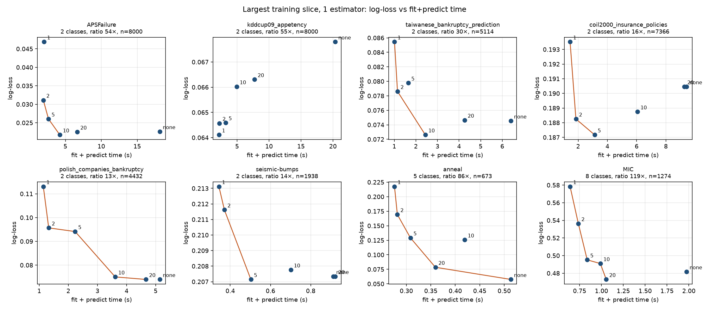

# `max_imbalance_ratio` on imbalanced TabArena tasks

CPU timings of `TabICLClassifier` on classification tasks from TabArena-v0.1
(OpenML suite 457). Each point is one imbalance cap. The orange line is the
Pareto front: higher ROC-AUC and lower fit+predict time, or lower log-loss
and lower time.

Protocol: one stratified 75/25 split (`random_state=0`). The test slice is
capped at 800 rows. Training rows are a stratified subsample of the requested
size, shared by every cap. `device="cpu"`, `use_amp=False`. One estimator uses
`norm_methods=["none"]`; four estimators use `["none", "power"]`. Caps that
sit above the natural majority/minority ratio do not drop rows. On those
runs the ROC-AUC and log-loss match the uncapped run exactly (seismic-bumps,
coil2000, and polish at cap 20).

Binary ROC-AUC does not depend on the Elkan correction: for two classes the
map is strictly increasing in the positive probability. AUC gaps across caps
are the effect of the shorter context. Log-loss moves for both reasons.
With more than two classes the normalizer depends on the features, so
one-vs-rest AUC can move as well.

## ROC-AUC vs time, largest training slice

One estimator. Labels are the cap (`none` keeps every training row).



| Task | Classes | Natural ratio | n | Time, no cap | Time, cap 5 | Speedup | ROC-AUC, no cap | ROC-AUC, cap 5 |
| --- | ---: | ---: | ---: | ---: | ---: | ---: | ---: | ---: |
| APSFailure | 2 | 54× | 8000 | 18.1 s | 2.7 s | 6.8× | 0.995 | 0.994 |
| kddcup09_appetency | 2 | 55× | 8000 | 20.4 s | 3.2 s | 6.4× | 0.916 | 0.929 |
| taiwanese_bankruptcy_prediction | 2 | 30× | 5114 | 6.4 s | 1.6 s | 3.9× | 0.947 | 0.941 |
| coil2000_insurance_policies | 2 | 16× | 7366 | 9.4 s | 3.1 s | 3.0× | 0.820 | 0.825 |
| polish_companies_bankruptcy | 2 | 13× | 4432 | 5.1 s | 2.2 s | 2.3× | 0.979 | 0.969 |
| seismic-bumps | 2 | 14× | 1938 | 0.91 s | 0.50 s | 1.8× | 0.786 | 0.779 |
| anneal | 5 | 86× | 673 | 0.51 s | 0.31 s | 1.7× | 1.000 | 0.989 |
| MIC | 8 | 119× | 1274 | 2.0 s | 0.84 s | 2.4× | 0.904 | 0.884 |

Cap 5 is on the ROC-AUC Pareto front for APSFailure, kddcup09_appetency,
coil2000, polish, and seismic-bumps. On kddcup09_appetency and coil2000 it
also beats the full context on ROC-AUC, so the uncapped run is dominated.
On taiwanese bankruptcy the front prefers cap 10 (AUC 0.949 at 2.4 s) over
cap 5 (0.941 at 1.6 s). On MIC, cap 20 keeps the AUC of the full context
(0.906 vs 0.904) at about half the time; cap 5 costs about 0.02 AUC.
Forcing a balanced context (cap 1) is the fastest point and is usually on
the front, but it is the one that gives up the most AUC (about 0.01 to 0.07).

The same shape shows up with four estimators. APSFailure at 5,000 rows drops
from 46 s to 9.6 s at cap 5, with ROC-AUC 0.996 to 0.989.



Times were not averaged. Sub-second runs move by a few tenths of a second
between repeats; speedups of 2× and more do not.

## Log-loss vs time

Log-loss is the metric the prior correction is aimed at. A shorter context
still throws away majority-class rows, so log-loss can rise even after the
correction. On the two largest binary tasks the corrected cap is as good as
or better than the full context.



A direct ablation, same fitted model, correction toggled off by pretending
the original counts equal the context counts (`max_imbalance_ratio=5`,
2,000 rows except anneal and MIC, which use the full training split):

| Task | ROC-AUC corrected | ROC-AUC uncorrected | Log-loss corrected | Log-loss uncorrected |
| --- | ---: | ---: | ---: | ---: |
| APSFailure | 0.986 | 0.986 | 0.037 | 0.068 |
| kddcup09_appetency | 0.914 | 0.914 | 0.065 | 0.165 |
| anneal | 0.989 | 0.990 | 0.129 | 0.192 |
| MIC | 0.884 | 0.880 | 0.495 | 0.992 |

On the binary tasks the AUC is identical, as the monotone map requires.
Mean predicted probabilities move onto the original training prior (APSFailure
majority mass 0.951 without the correction, 0.984 with it, training prior
0.982). On MIC the majority class mean goes from 0.47 to 0.84, against a
training prior of 0.84, and log-loss halves. Anneal's one-vs-rest AUC shifts
by 0.001 because the multiclass normalizer depends on the features.

## Reproduce

```bash
python benchmarks/max_imbalance_ratio/run_experiment.py \
    --datasets seismic-bumps anneal MIC polish_companies_bankruptcy \
        taiwanese_bankruptcy_prediction coil2000_insurance_policies \
        APSFailure kddcup09_appetency \
    --train-sizes 800 2000 5000 8000 \
    --ratios none 20 10 5 2 1 \
    --n-estimators 1
```

Rows already present in `results.csv` are skipped. Plots are rewritten from
that file at the end of the run.
