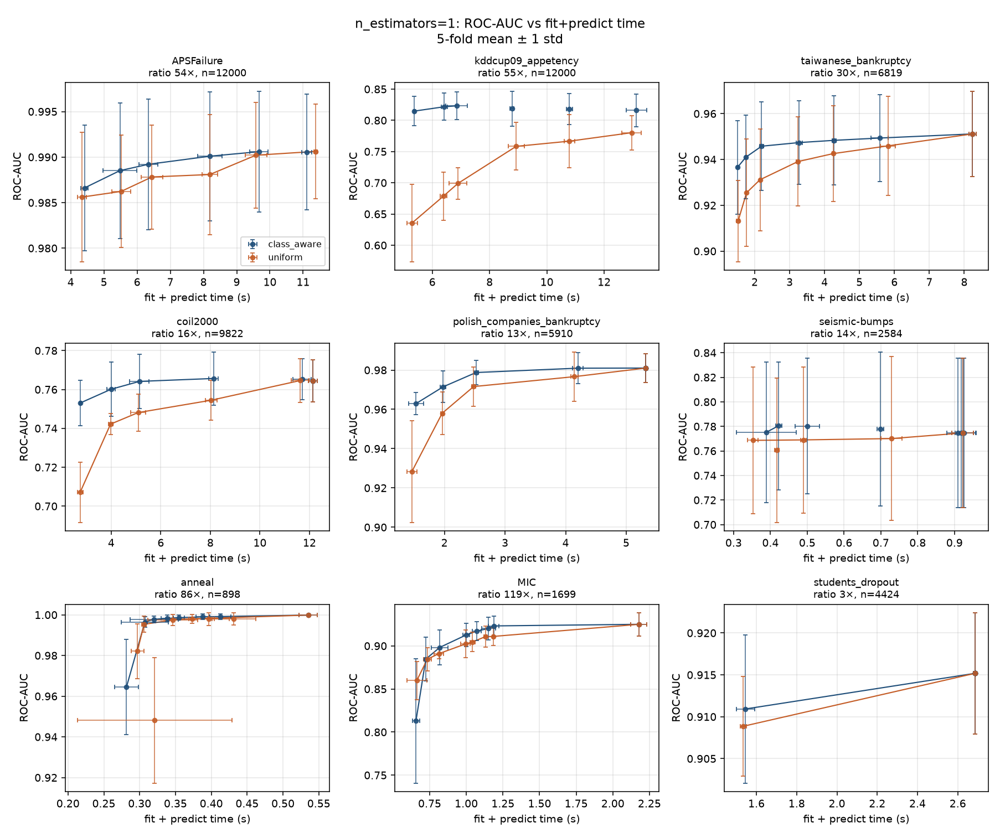
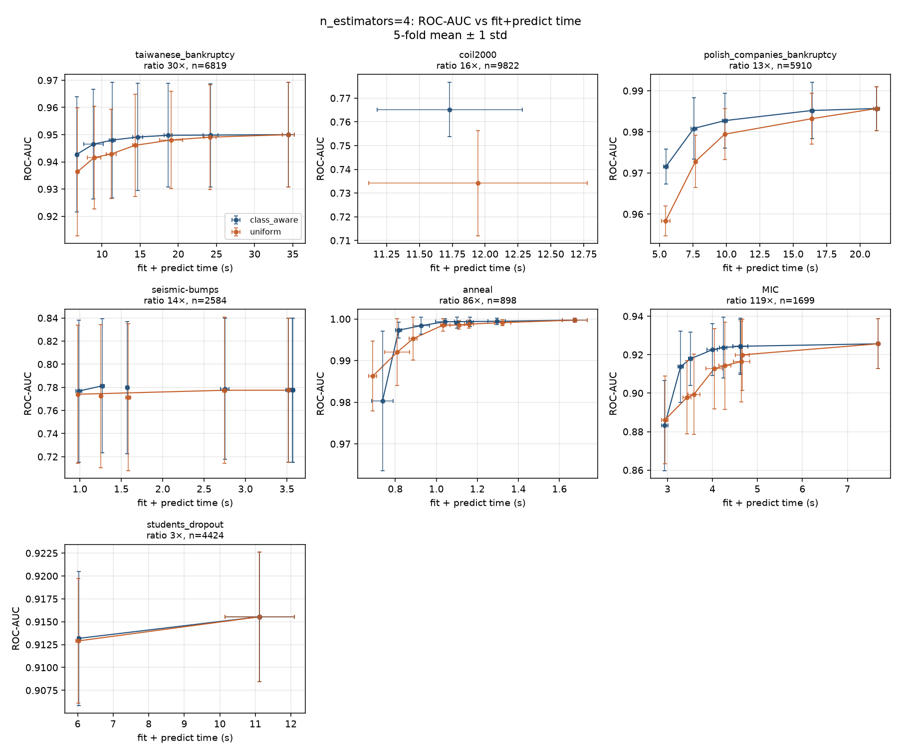
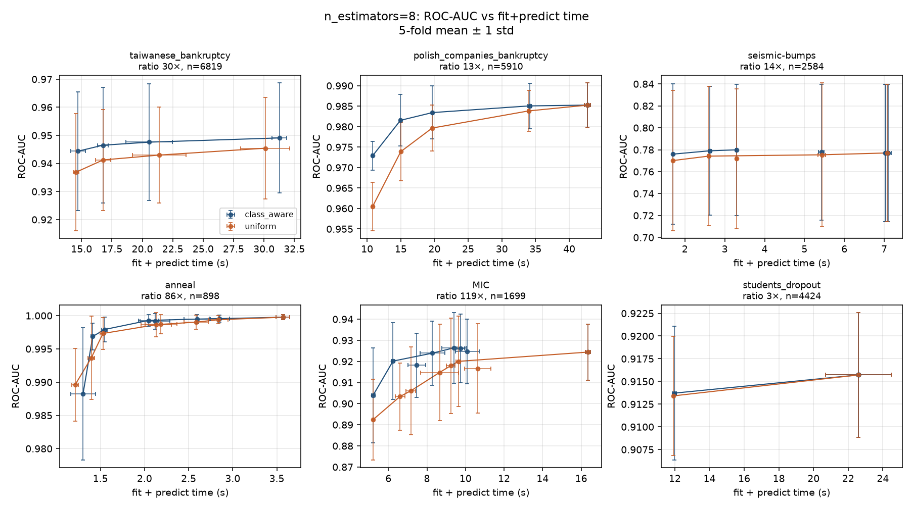
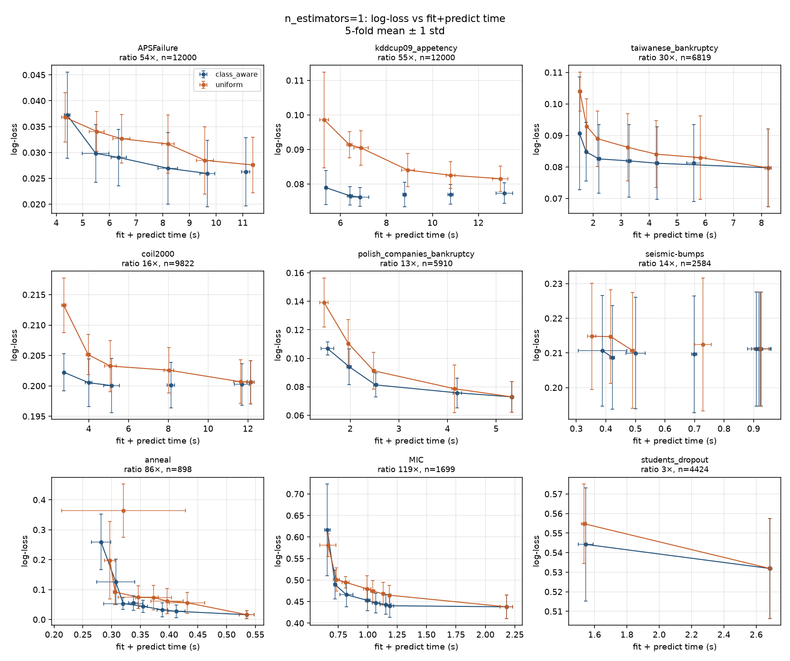
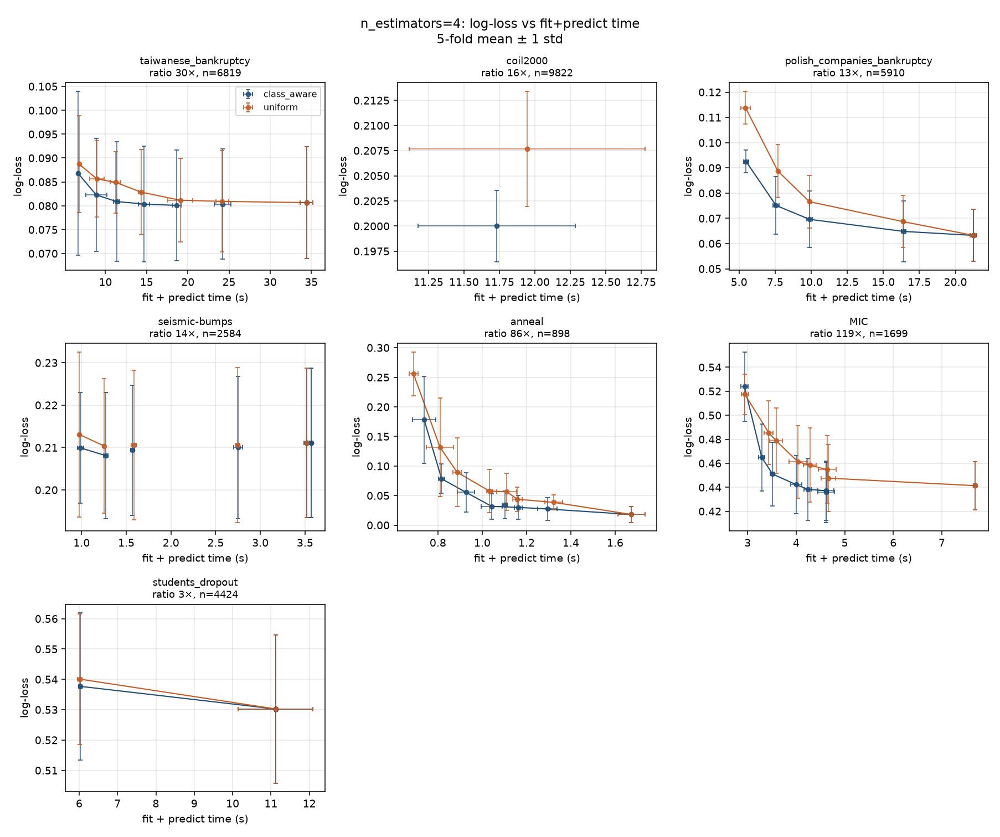
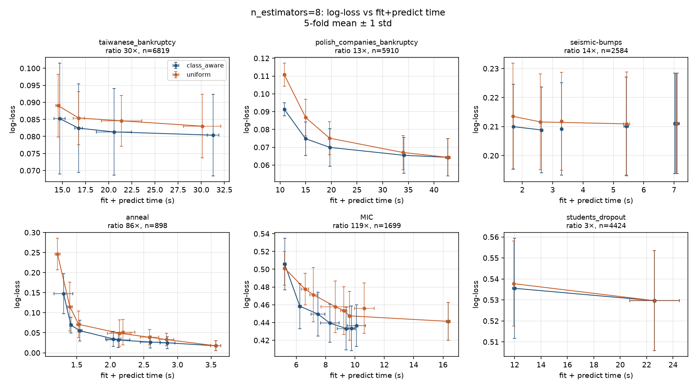

# 5-fold CV of `max_imbalance_ratio`

Stratified 5-fold CV (`shuffle=True`, `random_state=0`) of
`TabICLClassifier` on CPU. Each ensemble member draws its own subsample.
Two subsamples with the same row count are compared:

- **class-aware** is `max_imbalance_ratio`. Majority classes are cut to
  `floor(ratio * n_minority)` rows. One multiclass Elkan correction is
  applied after the ensemble softmax, using the original training counts
  as the target prior.
- **uniform** draws that same number of rows uniformly, rejecting draws
  that drop a class. No Elkan correction is applied. This is only an
  experiment control. It is not a library option.

The grid is `n_estimators` in `{1, 4, 8}` and caps in
`{1, 3, 5, 10, 15, 20, 30, None}`. `norm_methods` is `["none"]` when
`n_estimators` is 1 and `["none", "power"]` otherwise. APSFailure
(76k rows) and kddcup09_appetency (50k rows) are stratified down to
12,000 rows before the split. Every other task is used in full.

Folds are run shortest prediction first. After each batch the prediction
is rescaled from the folds just measured. A fold is not started when that
prediction is above **15 seconds**. Those skips are listed in
`skipped_cv.csv`. Some longer folds were already finished before that
cutoff (polish, students, taiwanese, and MIC at 8 members) and are kept.
Taiwanese bankruptcy at 8 members and cap 15 was interrupted after 3 folds
of about 40 seconds; those partial folds are not in the tables.

A cap at or above the training fold's natural ratio does not drop rows.
Class-aware and uniform are then the same full context, so only the
class-aware fit is run and the point is drawn on both curves.

Points are fold means. Bars are ±1 sample standard deviation. The line
is the Pareto front of the means. Fold rows are in `results_cv.csv`;
means are in `results_cv_summary.csv`.

Binary ROC-AUC does not move because of the Elkan correction itself: for
two classes the map is strictly increasing. AUC gaps are the effect of
which rows are kept. Log-loss moves for both reasons. With more than two
classes the normalizer depends on the features, so one-vs-rest AUC can
move as well.

## ROC-AUC

## Log-loss

## Class-aware cap 20 versus the full context

`Δ` is the mean over folds of (cap 20 − uncapped) on the same fold.
The ± term is the standard deviation of that paired difference. Caps
that do not bind (seismic-bumps, coil2000, polish, students) match the
uncapped run exactly and are omitted.

| Task | Members | Cap 20 time | Speedup | Δ ROC-AUC | Δ log-loss |
| --- | ---: | ---: | ---: | ---: | ---: |
| MIC (8 classes, 119×) | 1 | 1.15 s vs 2.18 s | 1.9× | −0.0048 ± 0.0080 | +0.0056 ± 0.0060 |
| MIC | 4 | 4.62 s vs 7.68 s | 1.7× | −0.0013 ± 0.0035 | −0.0042 ± 0.0086 |
| MIC | 8 | 9.40 s vs 16.4 s | 1.7× | +0.0020 ± 0.0048 | −0.0081 ± 0.0053 |
| anneal (5 classes, 86×) | 1 | 0.39 s vs 0.54 s | 1.4× | −0.0009 ± 0.0013 | +0.0164 ± 0.0134 |
| anneal | 4 | 1.16 s vs 1.67 s | 1.4× | −0.0004 ± 0.0010 | +0.0119 ± 0.0131 |
| anneal | 8 | 2.60 s vs 3.57 s | 1.4× | −0.0003 ± 0.0004 | +0.0094 ± 0.0098 |
| taiwanese bankruptcy (30×) | 1 | 5.58 s vs 8.24 s | 1.5× | −0.0018 ± 0.0016 | +0.0015 ± 0.0013 |
| taiwanese bankruptcy | 4 | 24.2 s vs 34.4 s | 1.4× | −0.0002 ± 0.0009 | −0.0003 ± 0.0006 |

At 4 and 8 members, cap 20 stays inside the fold noise on ROC-AUC.
MIC at 8 members actually improves log-loss by more than one standard
deviation (−0.0081 ± 0.0053). With a single member the same cap is
still close, but anneal log-loss (+0.016 ± 0.013) and taiwanese ROC-AUC
(−0.0018 ± 0.0016) sit just outside one standard deviation.

Tighter caps cost more. At 4 members, MIC cap 5 loses 0.0078 ± 0.0052
ROC-AUC and anneal cap 5 raises log-loss by 0.037 ± 0.040. Cap 1 is
worse, especially with one member: MIC loses 0.112 ± 0.065 ROC-AUC and
anneal log-loss rises by 0.243 ± 0.101.

Taiwanese bankruptcy at 8 members was not run at cap 20. That fit was
predicted at about 50 seconds. The uncapped 8-member fit on that task
was also not completed under the 15-second rule.

## Uniform versus class-aware

Uniform is the same context length without balancing the classes and
without the Elkan map. Mean paired ROC-AUC (uniform − class-aware),
averaged over tasks that have both:

| Cap | 1 member | 4 members | 8 members |
| ---: | ---: | ---: | ---: |
| 1 | −0.029 | −0.006 | −0.006 |
| 5 | −0.023 | −0.008 | −0.006 |
| 20 | −0.010 | −0.003 | −0.004 |

The gap is largest where the positive class is rare and the draw is
small. On kddcup09_appetency with one member, uniform cap 1 loses
0.179 ± 0.078 ROC-AUC against class-aware (0.636 vs 0.815) in the same
5.3 seconds. At cap 20 the loss is still 0.036 ± 0.006. On APSFailure
the two strategies already agree at cap 20 (both ROC-AUC 0.9906);
uniform cap 1 is only 0.001 below class-aware because that task remains
easy with a handful of minority rows.

More ensemble members shrink the uniform penalty, but they do not remove
it. Class-aware is the better of the two at every cap that was measured.

## Large tasks inside the 15-second budget

Uncapped APSFailure and kddcup09_appetency were not fit. A single member
on the full 9,600-row context was predicted at about 23 seconds and
27 seconds. With one member the class-aware curve is flat well before
that:

| Task | Cap | Time | ROC-AUC | Log-loss |
| --- | ---: | ---: | ---: | ---: |
| APSFailure (54×, n=12000) | 1 | 4.4 s | 0.9866 ± 0.0069 | 0.0372 |
| APSFailure | 5 | 6.3 s | 0.9892 ± 0.0072 | 0.0290 |
| APSFailure | 20 | 11.1 s | 0.9906 ± 0.0063 | 0.0262 |
| kddcup09_appetency (55×, n=12000) | 1 | 5.4 s | 0.8148 ± 0.0238 | 0.0789 |
| kddcup09_appetency | 5 | 6.9 s | 0.8233 ± 0.0222 | 0.0762 |
| kddcup09_appetency | 20 | 13.1 s | 0.8159 ± 0.0261 | 0.0774 |

On coil2000 (16×, one member) cap 5 is already at the uncapped ROC-AUC
(0.764 vs 0.765) and is 2.4× faster (5.1 s vs 12.1 s). Cap 1 is the
one that moves (0.753, −0.011 ± 0.014).

Four-member and eight-member fits on APSFailure, kddcup09_appetency, and
coil2000 beyond cap 1 were predicted above 15 seconds and were not run.
coil2000 at 4 members and cap 1 took 11.2 seconds (class-aware ROC-AUC
0.765 vs uniform 0.734).

## Recommendation

The estimator default stays **`None`**. Undersampling is opt-in.

When turning it on, **20** is the cap that preserves ROC-AUC and
log-loss for an ensemble of 4 or 8 members on every task where the
uncapped fit was measured. It is exactly a no-op when the natural ratio
is already below 20. Caps of 5 and below are faster, and they are the
ones that move MIC, anneal, and the bankruptcy tasks past the fold noise.

Use the class-aware draw. A uniform subsample of the same length is
slower to reach the same ROC-AUC, and on kddcup09_appetency it does not
catch up inside this grid.
