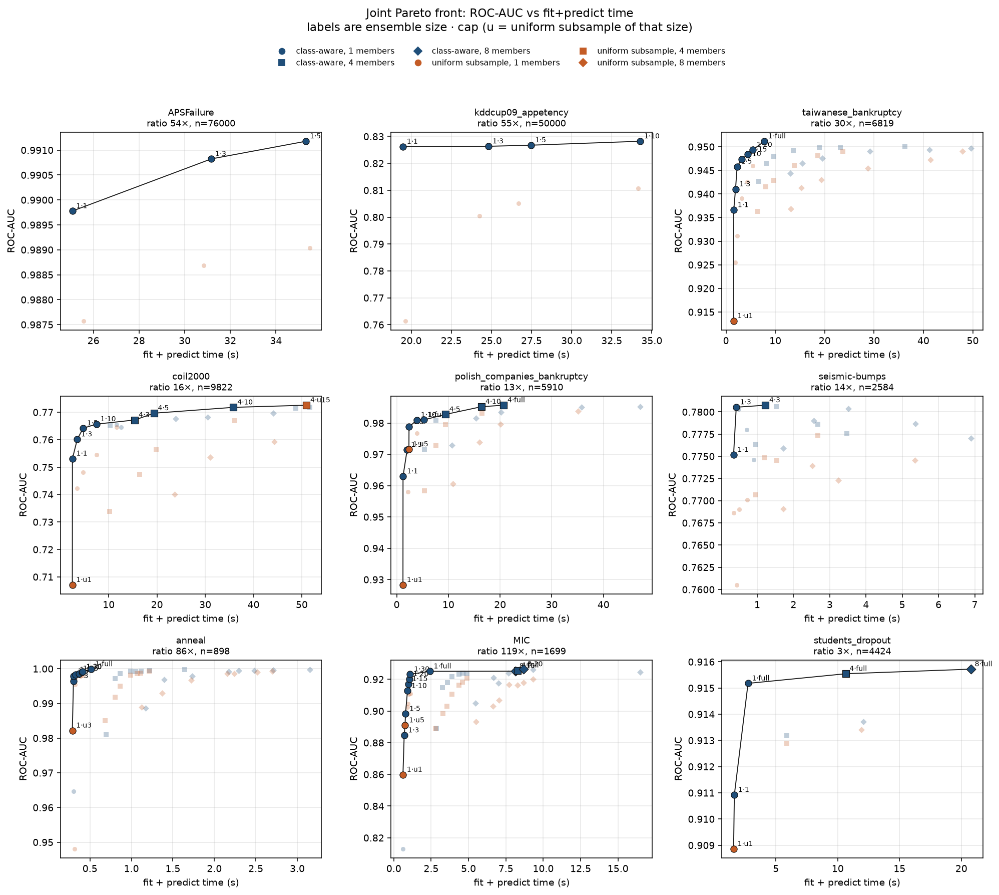
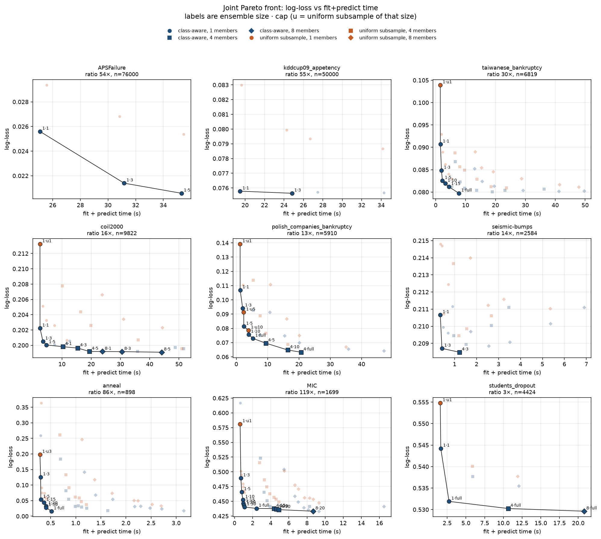

# 5-fold CV of `max_imbalance_ratio` and `subsample`

Stratified 5-fold CV (`shuffle=True`, `random_state=0`) of
`TabICLClassifier` on CPU. Tables are not cut down before `fit`.
APSFailure is the full 76,000 rows and kddcup09_appetency is the full
50,000 rows. Each ensemble member draws its own subsample inside the
estimator.

Two draws with the same row count are compared:

- **class-aware** is `max_imbalance_ratio`. Majority classes are cut to
  `floor(ratio * n_minority)` rows. One multiclass Elkan correction is
  applied after the ensemble softmax, using the original training counts
  as the target prior.
- **uniform** is `subsample` set to that same row count, with
  `max_imbalance_ratio` left unset. The estimator draws uniformly, keeps
  every class, and does not apply the Elkan correction. This control is
  not a second library mode. It is the `subsample` parameter.

The grid is `n_estimators` in `{1, 4, 8}` and caps in
`{1, 3, 5, 10, 15, 20, 30, None}`. `norm_methods` is `["none"]` when
`n_estimators` is 1 and `["none", "power"]` otherwise.

Folds run shortest prediction first. After each batch the prediction is
rescaled from the folds just measured. A fold is not started when that
prediction is above **60 seconds**. Skips are listed in `skipped_cv.csv`.
The first 4-member, cap-1 fold on the full APSFailure table took 109
seconds, and the matching kddcup09_appetency fold took 91 seconds. The
other folds of those two configs were not run, and the single folds are
not in the tables below.

A cap at or above the training fold's natural ratio does not drop rows.
Class-aware and uniform are then the same full context, so only the
class-aware fit is run and the point is drawn on both curves.

Points are fold means. Bars are ±1 sample standard deviation. The line
is the Pareto front of the means. Fold rows are in `results_cv.csv`;
means are in `results_cv_summary.csv`.

Binary ROC-AUC does not move because of the Elkan correction itself: for
two classes the map is strictly increasing. AUC gaps are the effect of
which rows are kept. Log-loss moves for both reasons. With more than two
classes the normalizer depends on the features, so one-vs-rest AUC can
move as well.

## ROC-AUC

## Log-loss

## Class-aware cap 20 versus the full context

`Δ` is the mean over folds of (cap 20 − uncapped) on the same fold.
The ± term is the standard deviation of that paired difference. Caps
that do not bind (seismic-bumps, coil2000, polish, students) match the
uncapped run exactly and are omitted. Uncapped APSFailure and
kddcup09_appetency were not fit: one member on the full training fold
was predicted above a minute.

| Task | Members | Cap 20 time | Speedup | Δ ROC-AUC | Δ log-loss |
| --- | ---: | ---: | ---: | ---: | ---: |
| MIC (8 classes, 119×) | 1 | 1.04 s vs 2.41 s | 2.3× | −0.0048 ± 0.0080 | +0.0056 ± 0.0060 |
| MIC | 4 | 4.62 s vs 8.27 s | 1.8× | −0.0018 ± 0.0038 | −0.0046 ± 0.0074 |
| MIC | 8 | 8.67 s vs 16.5 s | 1.9× | +0.0020 ± 0.0048 | −0.0081 ± 0.0053 |
| anneal (5 classes, 86×) | 1 | 0.41 s vs 0.52 s | 1.3× | −0.0009 ± 0.0013 | +0.0164 ± 0.0134 |
| anneal | 4 | 1.12 s vs 1.64 s | 1.5× | −0.0004 ± 0.0009 | +0.0109 ± 0.0121 |
| anneal | 8 | 2.48 s vs 3.15 s | 1.3× | −0.0004 ± 0.0006 | +0.0090 ± 0.0091 |
| taiwanese bankruptcy (30×) | 1 | 5.43 s vs 7.78 s | 1.4× | −0.0018 ± 0.0016 | +0.0015 ± 0.0013 |
| taiwanese bankruptcy | 4 | 23.1 s vs 36.3 s | 1.6× | −0.0002 ± 0.0009 | −0.0003 ± 0.0006 |

At 4 members, cap 20 stays inside the fold noise on both metrics.
At 8 members the ROC-AUC gap is still inside that noise, and MIC
log-loss improves by more than one standard deviation (−0.0081 ± 0.0053).
With one member, anneal log-loss (+0.016 ± 0.013) and taiwanese ROC-AUC
(−0.0018 ± 0.0016) sit just outside one standard deviation.

Cap 5 is where the loss shows up. At 4 members, MIC loses
0.0078 ± 0.0068 ROC-AUC. Anneal log-loss rises by 0.036 ± 0.040.
Taiwanese bankruptcy at cap 5 is 3.8× faster (9.7 s vs 36.3 s) and stays
inside the ROC-AUC noise (−0.0020 ± 0.0022). Coil2000 at cap 5 is 2.5×
faster (19.4 s vs 48.7 s) with Δ ROC-AUC −0.0018 ± 0.0055.

Taiwanese bankruptcy at 8 members was not run past cap 15. Those fits
were at the one-minute line (cap 15 took 42 seconds) and cap 20 was
predicted above it.

## Uniform `subsample` versus class-aware

Mean paired ROC-AUC (uniform − class-aware), averaged over tasks that
have both:

| Cap | 1 member | 4 members | 8 members |
| ---: | ---: | ---: | ---: |
| 1 | −0.017 | −0.008 | −0.009 |
| 5 | −0.010 | −0.008 | −0.006 |
| 20 | −0.005 | −0.002 | −0.003 |

On the full kddcup09_appetency table with one member, uniform cap 1
scores 0.761 against 0.826 for class-aware, both in about 19.5 seconds.
At cap 10 the uniform score is 0.811 against 0.828. On the full
APSFailure table the gap is smaller: at cap 5, uniform ROC-AUC is
0.9890 against 0.9912, and log-loss is 0.0254 against 0.0206.

Class-aware remains the better draw at every cap that was measured.
More ensemble members shrink the gap. They do not reverse it.

## Large tasks inside one minute

With one member, the class-aware curve on the full tables is flat well
before the fits that were skipped:

| Task | Cap | Context | Time | ROC-AUC | Log-loss |
| --- | ---: | ---: | ---: | ---: | ---: |
| APSFailure (54×, n=76000) | 1 | 2200 | 25.1 s | 0.9898 ± 0.0039 | 0.0256 |
| APSFailure | 5 | 6600 | 35.3 s | 0.9912 ± 0.0040 | 0.0206 |
| kddcup09_appetency (55×, n=50000) | 1 | 1424 | 19.5 s | 0.8262 ± 0.0139 | 0.0758 |
| kddcup09_appetency | 5 | 4272 | 27.5 s | 0.8268 ± 0.0134 | 0.0757 |
| kddcup09_appetency | 10 | 7832 | 34.3 s | 0.8282 ± 0.0127 | 0.0757 |

Caps above those, and every 4- and 8-member fit on these two tasks, were
predicted above a minute and were not run. The minority class is larger
on the full table than on a 12,000-row slice, so the same ratio keeps
more rows and the fit costs more.

## Joint Pareto front

Each panel below puts every measured combination on one axes:
`max_imbalance_ratio`, a uniform `subsample` of that same size, and
`n_estimators` in `{1, 4, 8}`. Faint points are off the front. The line
connects the Pareto front of the fold means. A label `1·5` is one member
and cap 5. `1·u1` is one member and a uniform subsample the size of cap 1.
`1·full` is a cap that does not drop rows. Caps that copy the same
full-context fit are drawn once. Membership is in `pareto_joint.csv`.

The ROC-AUC front is the class-aware curve at **one member**, from a
small cap up to the fullest context that was measured. Four and eight
members show up only at the slow end, and only on some tasks:

- Anneal and taiwanese bankruptcy: no ensemble point is on the ROC-AUC front.
- MIC: eight members at cap 20 add 0.0014 AUC over the one-member full context (2.4 s → 8.7 s).
- Coil2000: four members at cap 10 add 0.006 AUC over one member at cap 10 (7.5 s → 36 s).
- Polish bankruptcy: four members on the full context add 0.0047 AUC (5.3 s → 21 s).
- Students dropout: eight members add 0.0005 AUC over one member on the full context (2.7 s → 21 s).

Uniform points sit under that curve. A matched uniform draw is faster
than class-aware by less than the fold-to-fold time noise on 93% of
pairs. It reaches the front only as the cheapest point, where that
tiny time edge comes with a real AUC drop (kddcup09 cap 1: 0.761 vs
0.826; coil2000 cap 1: 0.707 vs 0.753).

Log-loss has the same shape. Multiclass tasks keep improving as the
context grows: anneal log-loss falls from 0.053 at cap 5 to 0.016 on
the full context, still with one member. MIC's lowest loss is eight
members at cap 20 (0.433 vs 0.438 for one member on the full context).

## Rules of thumb

1. Leave `subsample` unset. To drop rows, set `max_imbalance_ratio`.
   A uniform subsample of the same length is not a faster route to the
   same ROC-AUC.

2. Stay at `n_estimators=1` until the context is as large as you are
   willing to pay for. Adding members is the expensive end of the front:
   about 0.005 AUC on coil2000 and polish, and under 0.002 AUC on the
   other tasks where 4 and 8 members were measured, for 3–5× the time.

3. Pick the cap on that one-member class-aware curve.
   - Natural ratio under about 5 (students dropout): leave the ratio unset. Cap 1 costs 0.004 AUC and 0.012 log-loss.
   - Binary ROC-AUC: cap **5** is within 0.0025 of the best measured one-member AUC on APSFailure, kddcup09, coil2000, polish, and seismic-bumps. Taiwanese bankruptcy (30×) still wants cap **20** (0.0018 below the full context; cap 5 is 0.0054 below).
   - Multiclass, or log-loss on a large ratio: cap **20**, or `None` if the fit is cheap. Cap 5 loses 0.027 AUC on MIC and 0.037 log-loss on anneal. Cap 20 brings those AUC gaps down to 0.0048 and 0.0009.

The library defaults stay `None`. If you are already using 4 members,
cap 20 is the opt-in that stayed inside the fold noise of the uncapped
run on every task where both were measured. It does not replace rule 2:
one member at cap 20 is the faster way to that same accuracy when you
are free to change `n_estimators`.
